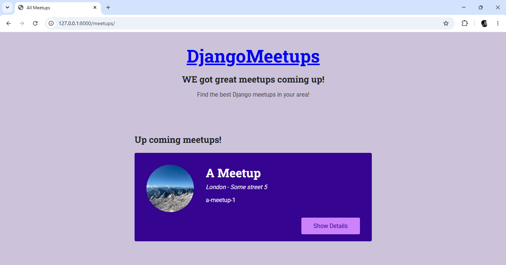

# Meetup Web

یک وب‌اپلیکیشن جنگو برای مدیریت و برگزاری میتاپ‌ها (Meetup) — [یک جمله کوتاه دیگر درباره هدف پروژه اینجا اضافه کن، مثلاً: "کاربران می‌توانند رویدادها را مشاهده، ایجاد و در آن‌ها ثبت‌نام کنند."]

## امکانات

- [ ] مشاهده لیست میتاپ‌ها
- [ ] ایجاد و مدیریت رویداد
- [ ] آپلود تصویر برای هر رویداد
- [ ] [امکان دیگری که پیاده‌سازی کردی]
- [ ] [امکان دیگری که پیاده‌سازی کردی]

> نکته: چک‌باکس‌های بالا رو با امکانات واقعی پروژه‌ات جایگزین/تکمیل کن.

## تکنولوژی‌ها

- Python / Django
- SQLite (پایگاه‌داده پیش‌فرض توسعه)
- python-decouple (مدیریت متغیرهای محیطی)

## پیش‌نیازها

- Python 3.10 یا بالاتر
- pip

## نصب و اجرا (محلی)

```bash
# کلون کردن مخزن
git clone https://github.com/mmdparimoon/Meetup-web.git
cd Meetup-web

# ساخت و فعال‌سازی محیط مجازی
python -m venv .venv
source .venv/Scripts/activate      # ویندوز (Git Bash)
# یا: .venv\Scripts\activate       # ویندوز (CMD/PowerShell)

# نصب پکیج‌ها
pip install -r requirements.txt

# تنظیم متغیرهای محیطی
cp .env.example .env
# سپس مقادیر داخل .env را با اطلاعات واقعی پر کن (مثلاً SECRET_KEY)

# اجرای مایگریشن‌ها
python manage.py migrate

# ساخت کاربر ادمین (اختیاری)
python manage.py createsuperuser

# اجرای سرور توسعه
python manage.py runserver
```

سپس در مرورگر به آدرس زیر برو:
```
http://127.0.0.1:8000/
```

## ساختار پروژه

```
Meetup-web/
├── meetup/            # تنظیمات اصلی پروژه (settings, urls, wsgi)
├── meetups/            # اپلیکیشن اصلی مدیریت رویدادها
├── uploads/images/     # تصاویر آپلودشده کاربران
├── .env.example        # نمونه متغیرهای محیطی مورد نیاز
├── requirements.txt     # وابستگی‌های پروژه
└── manage.py
```

## متغیرهای محیطی

فایل `.env` باید شامل موارد زیر باشد (نمونه در `.env.example`):

```
SECRET_KEY=your-secret-key-here
DEBUG=True
```

## اسکرین‌شات



## مجوز (License)

Udemy

## نویسنده

Mohammad Parimoon